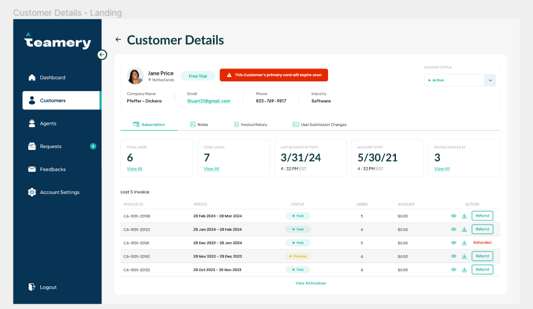

# Code Test Implementation Guide

## Overview

This document provides a step-by-step guide for implementing a Figma screen using the current Blade structure of the project. The implementation involves organizing styles, scripts, and sidebar HTML content into specific Blade files and following best practices for managing scoped styles.

## Steps to Implement the Figma Screen

### 1. Implementing the Figma Screen
- **Blade File:** Place the Figma screen content in the `dashboard.customers.details` Blade file.
    - Path: `resources/views/dashboard/customers/details.blade.php`
  
- **Figma Screen:**


### 2. Managing Styles

#### 2.1. Including Style CDNs
- **Blade File:** Add style CDNs to the `style` Blade file.
    - Path: `resources/views/layout/styles.blade.php`

#### 2.2. Adding Custom Styles
- **Public Folder:** Create a style file in the `public` folder.
    - Example Path: `public/css/custom-styles.css`
- **Import Style:** Import the custom style file in the `style` Blade file.
    - Path: `resources/views/layout/styles.blade.php`
    - Example Code:
      ```html
      <link rel="stylesheet" href="{{ asset('css/custom-styles.css') }}">
      ```

#### 2.3. Scoped Styles
- **Scoped Styles:** If the styles are scoped to a certain component or section, push them into the `styles` stack.
    - Example Code:
      ```blade
      @push('styles')
      <style>
        /* Scoped styles go here */
      </style>
      @endpush
      ```

### 3. Managing Scripts

#### 3.1. Including Script CDNs
- **Blade File:** Add script CDNs to the `script` Blade file.
    - Path: `resources/views/layout/scripts.blade.php`

### 4. Managing Sidebar HTML Content
- **Blade File:** Place the sidebar HTML content into the `sidebar.blade.php` file.
    - Path: `resources/views/layout/sidebar.blade.php`

## File Structure

Below is the summary of the file structure for the implementation:

```
resources/views/
├── dashboard/
│   └── customers/
│       └── details.blade.php
├── layout/
│   ├── styles.blade.php
│   ├── scripts.blade.php
│   └── sidebar.blade.php
public/
└── css/
    └── custom-styles.css
```

## Example Code Snippets

### Including Style CDNs
`resources/views/layouts/style.blade.php`
```html
<link rel="stylesheet" href="https://example-cdn.com/styles.css">
<link rel="stylesheet" href="{{ asset('css/custom-styles.css') }}">
```

### Scoped Styles
`resources/views/dashboard/customers/details.blade.php`
```blade
@push('styles')
<style>
  .custom-component {
    /* Scoped styles */
  }
</style>
@endpush
```

### Including Script CDNs
`resources/views/layouts/script.blade.php`
```html
<script src="https://example-cdn.com/script.js"></script>
```

### Sidebar HTML Content
`resources/views/layouts/sidebar.blade.php`
```html
<div class="sidebar">
  <!-- Sidebar content -->
</div>
```

This README provides a clear and structured guide for implementing the Figma screen, organizing styles and scripts, and managing sidebar content within the Blade structure of the Laravel project.